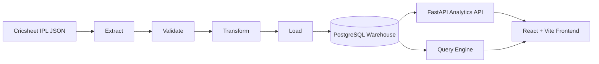
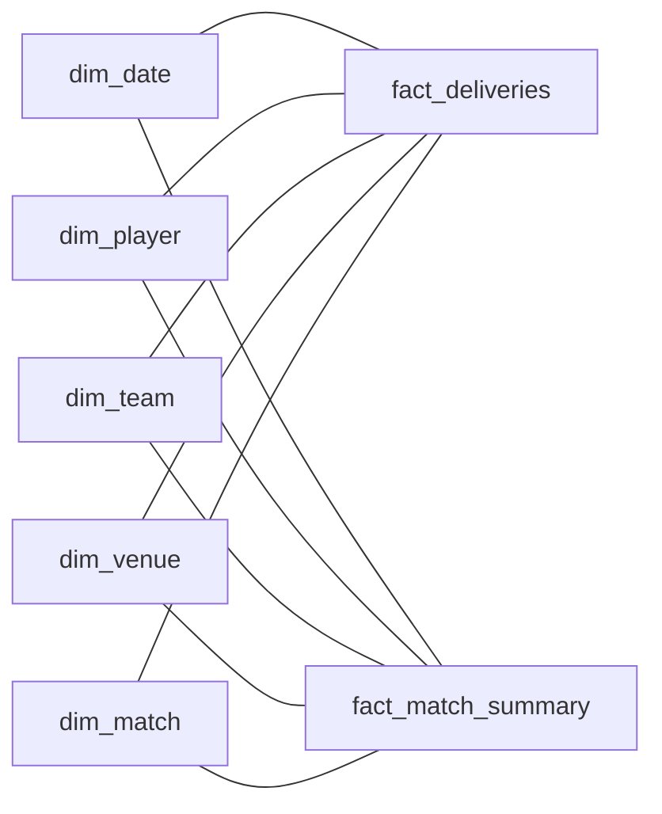
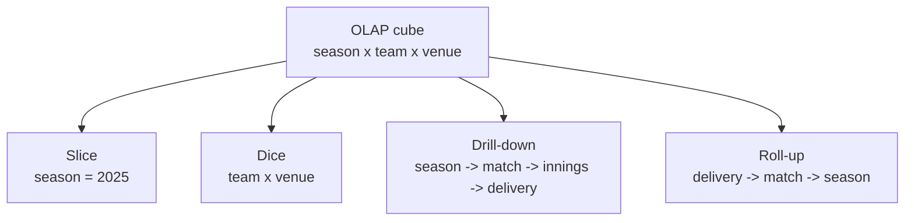
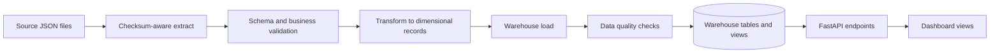
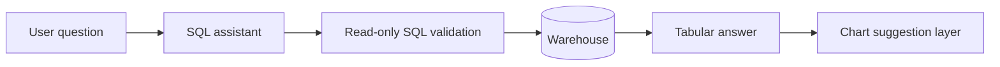
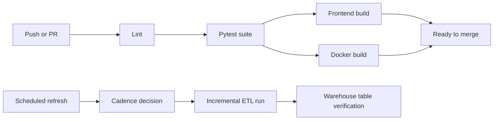

# IPL Warehouse

An IPL-focused dimensional analytics platform built on a PostgreSQL warehouse, a Python ETL pipeline, a FastAPI analytics layer, and a React frontend designed for OLAP-style exploration.


## Why This Project Exists

Most cricket dashboards stop at charts. This project treats IPL analytics as a warehouse problem first and a UI problem second.

- Facts are modeled at delivery grain and match grain.
- Dimensions provide reusable filters for season, player, team, venue, and match context.
- OLAP operations such as slice, dice, drill-down, and roll-up are reflected in the product, not only in SQL scripts.
- Natural-language querying is constrained by warehouse grain, safe SQL validation, and presentation-ready answers.

## System At a Glance



## Warehouse Model

The warehouse is star-first, with two central fact tables supported by conformed dimensions.



### Core Modeling Ideas

- `fact_deliveries` stores ball-by-ball measures such as runs, wickets, boundaries, powerplay flags, and cumulative state.
- `fact_match_summary` stores one row per match with winners, margins, toss outcomes, team scores, and player-of-the-match information.
- `dim_date`, `dim_team`, `dim_player`, `dim_venue`, and `dim_match` act as conformed dimensions across the full analytical surface.
- Historical teams remain analytically visible as their own members instead of being hidden inside current franchise names.

## OLAP Lens

The main cube in this project is built around season, team, and venue, with drill paths down to match and delivery detail.



### Supported OLAP Behaviors

- Slice by season, venue, team, player, or rivalry.
- Dice across multiple dimensions such as venue by season or team by toss outcome.
- Drill down from summary KPIs to seasonal views, match results, and delivery-level evidence.
- Roll up detailed events into innings, match, season, and league-wide metrics.

## End-to-End Flow



## Query Engine Flow

The query engine is designed to answer analytical questions without allowing arbitrary write access or schema drift.



### Query Engine Guardrails

- Only approved warehouse tables can be referenced.
- Generated SQL is normalized for season literals, boolean aggregates, and warehouse player-name formats.
- Simple warehouse-native questions such as season winners and player-of-the-match leaders use deterministic SQL instead of relying only on model inference.
- Returned answers are shaped into scalar, text, or table responses for cleaner frontend rendering.

## Product Surface

| View | What It Answers |
|------|-----------------|
| Overview | Warehouse KPIs, season trends, top performers, star schema and OLAP primer |
| Batting | Run leaders, strike-rate pressure, boundary output |
| Bowling | Wicket leaders, economy, dot-ball control |
| Teams | Franchise win shape, toss decisions, seasonal performance |
| Venues | Run-rate environments, chase success, boundary pressure |
| Head-to-Head | Rivalry balance, seasonal matchup swings, top batters |
| Query Lab | Natural-language SQL, answer tables, auto-generated visuals |

## Key Features

- Incremental ETL pipeline with warehouse-safe load behavior.
- Delivery-grain and match-grain facts with conformed dimensions.
- Data quality checks and ETL logging.
- React frontend optimized for desktop and mobile analytics reading.
- Query engine grounded in warehouse grain and safe SQL constraints.
- CI pipeline covering lint, tests, frontend build, and Docker build.
- Scheduled warehouse refresh workflow for recurring ETL updates.

## Quick Start

### Prerequisites

- Python 3.11+
- Node.js 20+
- PostgreSQL 15+ or Supabase
- Docker, optional

### Local Setup

```bash
python -m venv .venv
.venv\Scripts\activate
pip install -r requirements.txt
python -m etl.pipeline --schema-only
python -m etl.pipeline --local-data ./ipl_json
uvicorn api.main:app --host 127.0.0.1 --port 8000
```

In a second terminal:

```bash
cd frontend
npm install
npm run dev
```

Then open `http://localhost:5173`.

## Repository Layout

```text
Warehouse/
├── api/                FastAPI routes, SQL assistant, query helpers
├── config/             Settings and logging
├── etl/                Extract, validate, transform, load, quality
├── frontend/           React + Vite application
├── ipl_json/           Raw IPL match JSON files
├── sql/                Schema, indexes, analytical SQL, views
├── tests/              Pytest suite
├── .github/workflows/  CI and warehouse refresh workflows
├── Dockerfile
├── docker-compose.yml
├── requirements.txt
└── README.md
```

## CI/CD and Refresh Automation



### What the Automation Covers

- Python lint and formatting checks.
- Full pytest execution.
- Production frontend bundle build.
- Docker image build verification.
- Scheduled or manual warehouse refresh with cadence control.

## Tech Stack

| Layer | Technology |
|------|------------|
| Data source | Cricsheet IPL JSON |
| ETL | Python, pandas, SQLAlchemy, psycopg2 |
| Warehouse | PostgreSQL |
| API | FastAPI |
| Frontend | React, Vite, Recharts |
| Testing | Pytest |
| Automation | GitHub Actions |

## Validation Commands

```bash
python -m pytest tests
cd frontend && npm run build
```

## Data Source

- Cricsheet IPL JSON archive: `https://cricsheet.org/downloads/ipl_json.zip`

## License

MIT License
